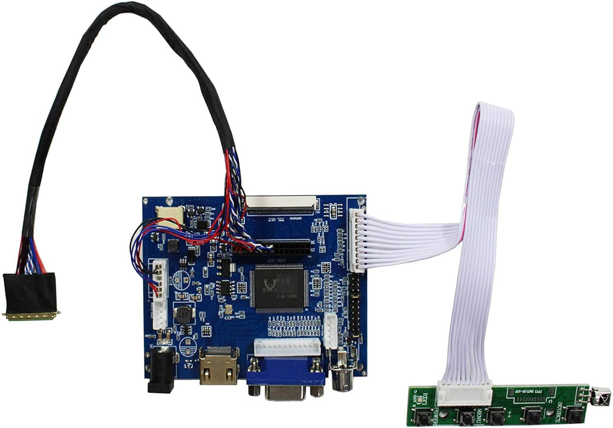
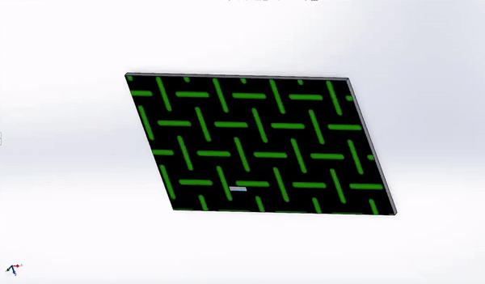
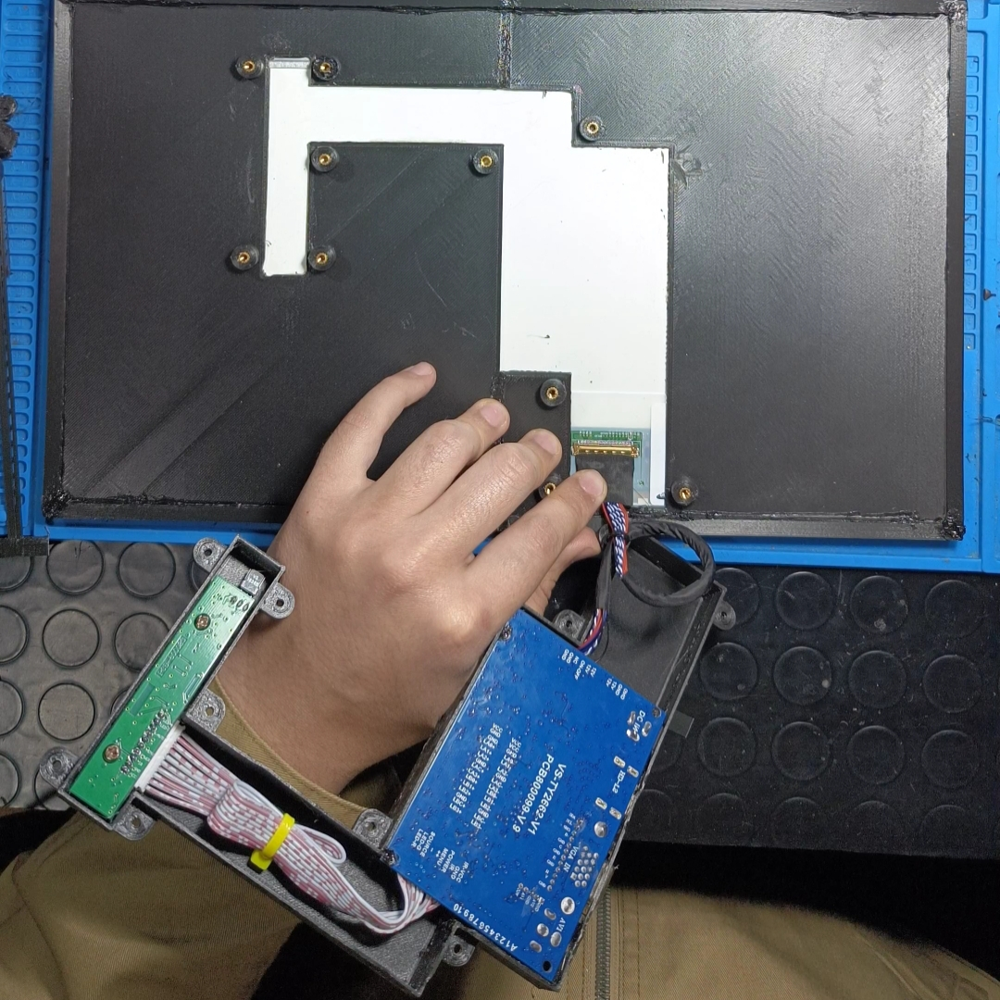
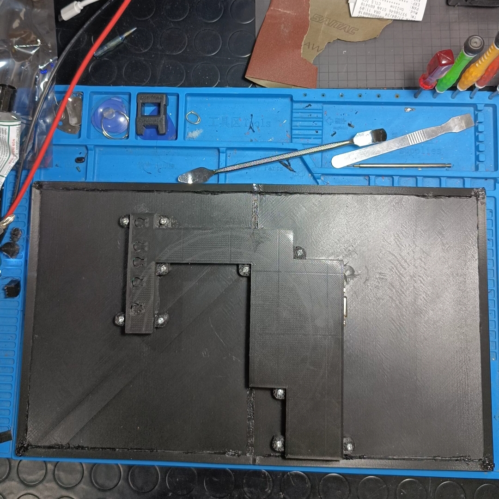
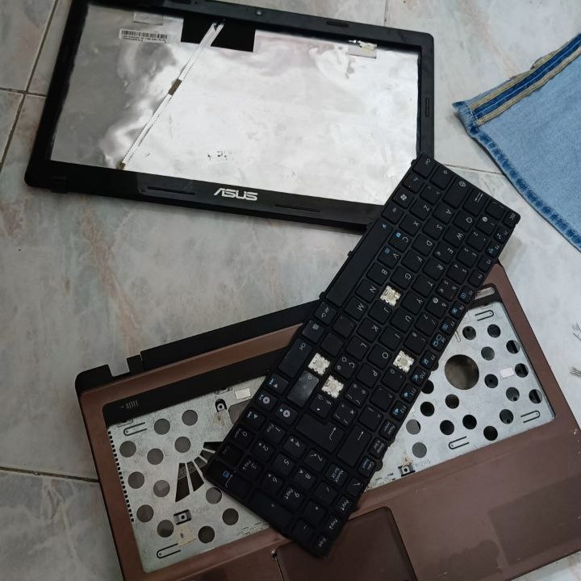

# Simple DIY portable monitor.

## Project Description.

This project is about making a portable monitor using 3D printable STL files and the display controller board of the VSDISPLAY brand, model 8541634866. The 15.6-inch display (model 8541634866) was salvaged from an old laptop.

## 3D printing

You can print components in full or print them subdivided if you have a smaller print plan than necessary. In the latter case, you will need to solder the plastic.

## Components

- VSDISPLAY display controller board, model 8541634866
- 15.6-inch display (model LTN140AT07) salvaged from an old laptop, but there are many other compatible models
- STL file for 3D printing of the monitor components.

*VSDISPLAY 8541634866*

## SOLIDWORS

## Mounting

## Final Result.

## Thanksgiving to the organ donor.

